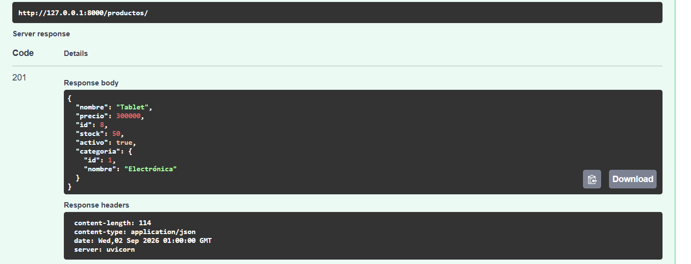
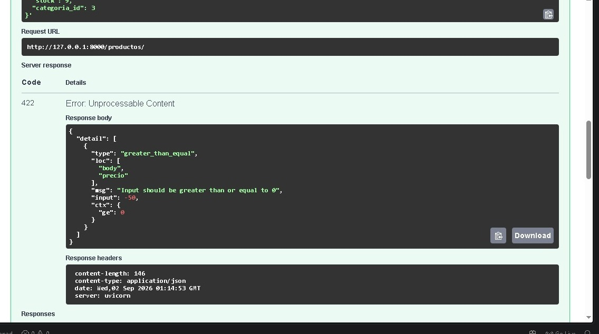
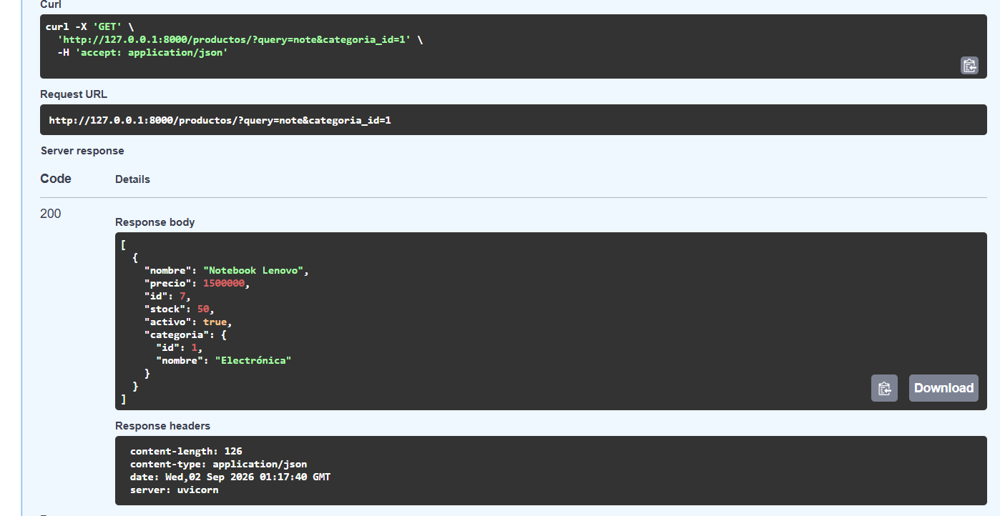
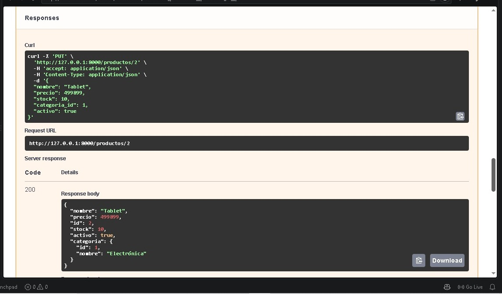
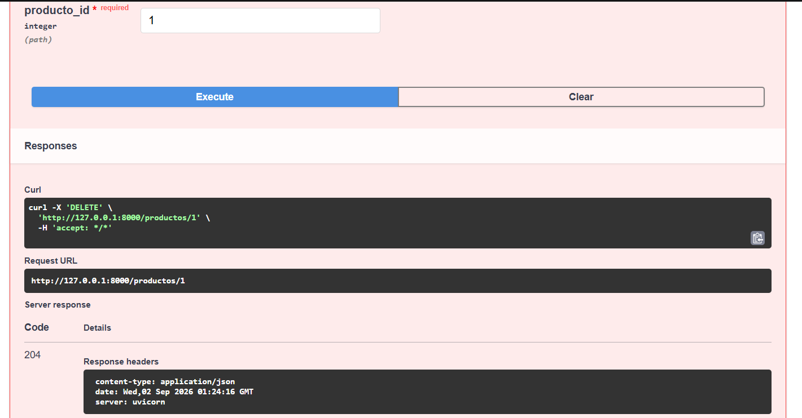
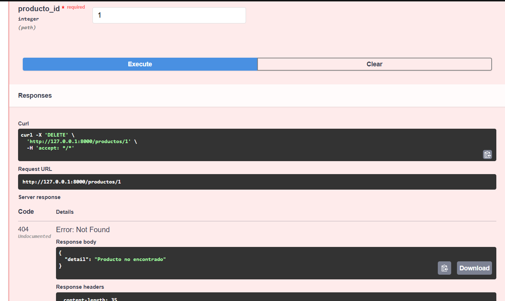
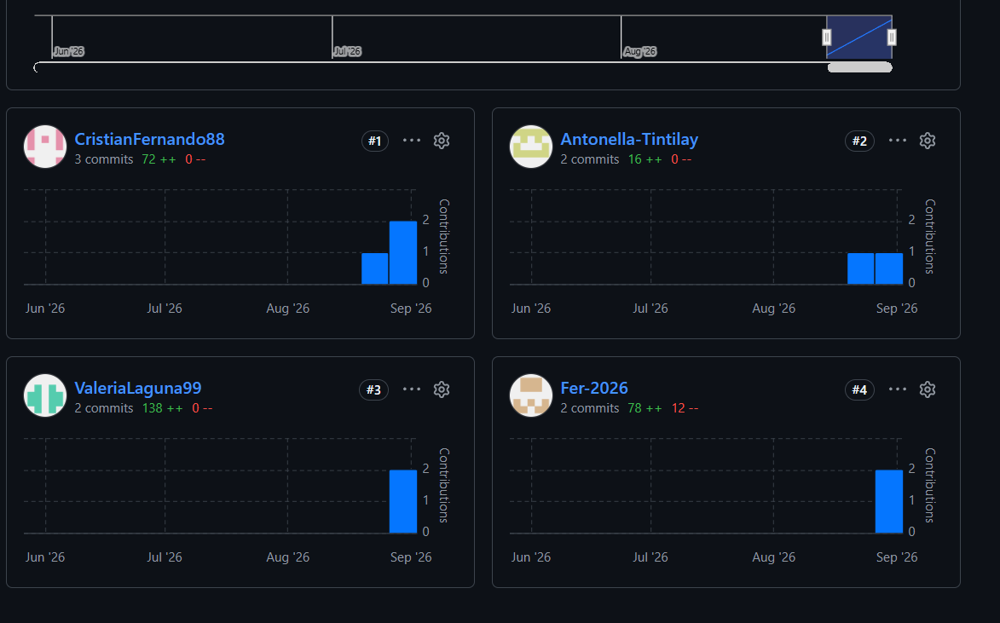

# API de Gestión de Productos (`tp-productos-api`)

## Descripción
Esta API RESTful desarrollada con **FastAPI** permite la gestión e interacción con productos y categorías. Utiliza `@dataclass` para los modelos del dominio y **Pydantic** para la validación y esquematización de las peticiones y respuestas HTTP.

---

## Integrantes del Grupo

| Nombre y Apellido | Usuario de GitHub |
| :---------------- | :---------------- |
| Integrante 1      | [@cristian-barrios-dev](https://github.com/usuario1) |
| Integrante 2      | [@Fer-2026](https://github.com/usuario2) |
| Integrante 3      | [@Valeria Laguna Roxana](https://github.com/usuario2) |
| Integrante 4      | [@Antonella-Tintilay](https://github.com/usuario2) |

---

## Estructura del Proyecto

```text
tp-productos-api/
├── app/
│   ├── main.py                   # Inicialización de FastAPI e inclusión de routers
│   ├── core/
│   │   └── db.py                 # Simulación de BD (listas de categorías y productos)
│   ├── models/
│   │   ├── categoria.py          # @dataclass Categoria
│   │   └── producto.py           # @dataclass Producto
│   └── api/
│       └── v1/
│           └── productos/
│               ├── router.py     # Endpoints HTTP para /productos (APIRouter)
│               ├── schemas.py    # Esquemas de Pydantic (Base, Create, Update, Response)
│               └── repository.py # Capa de acceso a datos y validaciones de negocio
├── .gitignore                    # Reglas de exclusión para Git (venv, __pycache__)
├── README.md                     # Documentación del proyecto
└── requirements.txt              # Dependencias del proyecto


## Instalación y ejecución

1. Creacíon del entorno virtual
 python -m venv venv
 venv\Scripts\activate

2. Instalación de las dependecias
 pip install -r requirements.txt

3. Ejecución de la app
 fastapi dev app/main.py

 http://127.0.0.1:8000/docs

## Endpoints

| Método | Endpoint | Descripción | Códigos de estado |
|---|---|---|---|
| GET | /productos | Lista productos (admite ?query= y ?categoria_id=, combinables) | 200 |
| GET | /productos/{id} | Obtiene un producto por id | 200, 404 |
| POST | /productos | Crea un producto nuevo | 201, 400, 422 |
| PUT | /productos/{id} | Actualiza parcialmente un producto | 200, 400, 404 |
| DELETE | /productos/{id} | Elimina un producto | 204, 404 |

## Pruebas en Swagger UI

Reemplazar cada línea por la captura correspondiente (arrastrar la imagen acá en GitHub).

1. Crear un producto válido → 201

   

2. Crear con categoria_id: 999 (inexistente) → 400

   

3. Crear con precio: -50 → 422 (validación Pydantic)

   
   

4. Listar filtrando /productos?query=...&categoria_id=1

   

5. Actualizar solo el precio con PUT (los demás campos no se modifican)

   

6. DELETE → 204 sin cuerpo. Repetir el mismo DELETE → 404

   
   

## Colaboradores del repositorio
 

## Historial de commits por autor
